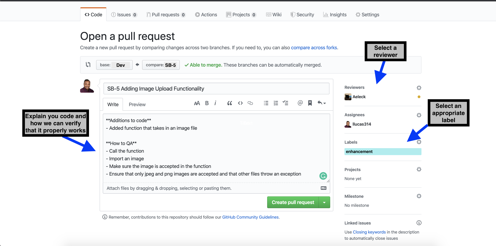

# steganography_backend

The app will allow a user to upload an image, and enter a message to be hidden in that image. The app will generate a copy of the original picture with the encrypted message embedded into the image’s pixels. The modifications to the encrypted picture should not be noticeable. The user can then send the encrypted image to someone. The receiver can then upload the modified image app. The app will display the decoded message. 

## Getting Started

These instructions will get you a copy of the project up and running on your local machine for development and testing purposes. See deployment for notes on how to deploy the project on a live system.

### Setup and Installation

You will need the following installed locally on your machine:

- [ `pipenv` ](https://github.com/pypa/pipenv) - It automatically creates and manages a virtualenv for your projects, as well as adds/removes packages from your Pipfile as you install/uninstall packages. 
- [ `pyenv` ](https://github.com/pyenv/pyenv) - The use of pyenv gives us the ability to manage python versions

- [If you need more help with set](https://dev.to/writingcode/the-python-virtual-environment-with-pyenv-pipenv-3mlo)

### Coding Style
- VSCode
- [`autopep8`](https://github.com/hhatto/autopep8) for Python. Ensure that it is installed on
your editor and that it is set to automatically format on save.
## How to contribute 
- Choose a task from [Trello](https://trello.com/b/wSnjd69D/steganograpy) to complete
- Create a new branch from dev - according to the naming convention (e.g. SB-1, SB-2), making sure that you have pull the lastest updates from dev
  1. `git pull orign dev`
  2. `git checkout -b SB-5 dev`
- Write and test you code. (Ensure to make meaninful commits. This comes in handy if we have an probems like merge conflicts)
  1. `git add <file.py>`
  2. `git commit -m "Added functionality for image upload"`
- When you are ready to push your commits, pull from dev again to make sure you are up to date, push, and make a pull request
  1. `git pull orign dev`
  2. `git push -u origin SB-5`
  3. Make a pull request in GitHub (Explain how to QA your code and select someone to review it)
   
- Once your code has been reviewed it will either be merged into dev or have changes requested
  
  

## Deployment

TBD

## Languages/Technologies Utilized
* Python

## Contributors
* Adam Beck
* Andrew Schaeffer
* Sara McConnell
* Lorenzo Lucas
